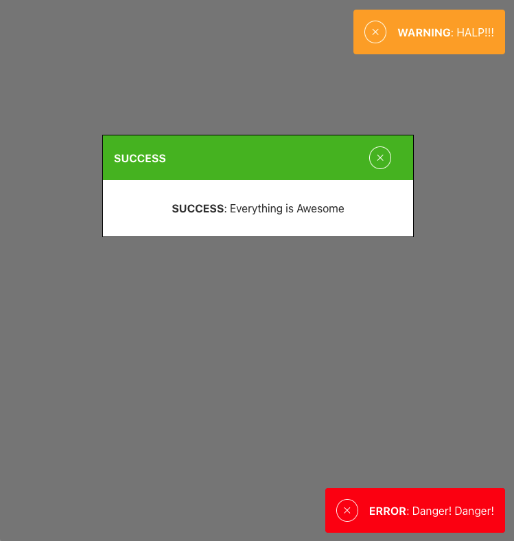

# Toasty

Alert, Notification, and Toast React component library

## Dependancies

- React
- TypeScript
- Rollup

## Usage

`npm i @garyanewsome/toasty`

```JS

import { Notification } from '@garyanewsome/toasty'

<Notification msg="My cool message" type="info" color="MyOptionalCustomColor" />
```

## Props

- msg - message to be shared with user
- type - one of 'error', 'info', 'success', or 'warning'
- color - optional - excepts either a hex code value ie '#123456', or word value ie 'teal'

## Default Colors

```json
{
  "error": "#ff0000",
  "info": "#50bfe6",
  "success": "#4CBB17",
  "warning": "#ffaa1d"
}
```

## Demo Images




